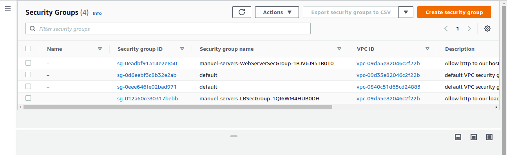

# udacity-cloudDevOps-project-two
Deploy a high-availability web app using CloudFormation project.

## Diagram:
- [URL-Link](https://lucid.app/lucidchart/2000c303-8611-4099-b1f5-8546e28e5f2d/edit?viewport_loc=-44%2C70%2C2076%2C1060%2C0_0&invitationId=inv_bb2212bf-3e40-4c3f-9187-79b54e8ab868#)
- This diagram is to visualize the aid to understand the CloudFormation script below.

## Script (Template and Parameters):
- This interprets the instructions and create a matching CloudFormation resources.

#### To install the network resources
- Run `./create.sh STACK-NAME network.yaml network-parameters.json`

#### To install the servers resource
- Run `./create.sh STACK-NAME servers.yaml servers-parameters.json`
- [Bucket Website Endpoint](http://manuel-1974215-udacity.s3-website-us-east-1.amazonaws.com/)

### Created Resources
|           .            |             .             |              .               |
|:----------------------:|:-------------------------:|:----------------------------:|
|    |     |          |
|     |  |  |
|  |         |     |
|  |    |           |

### Author:
- Matembu Emmanuel Dominic
